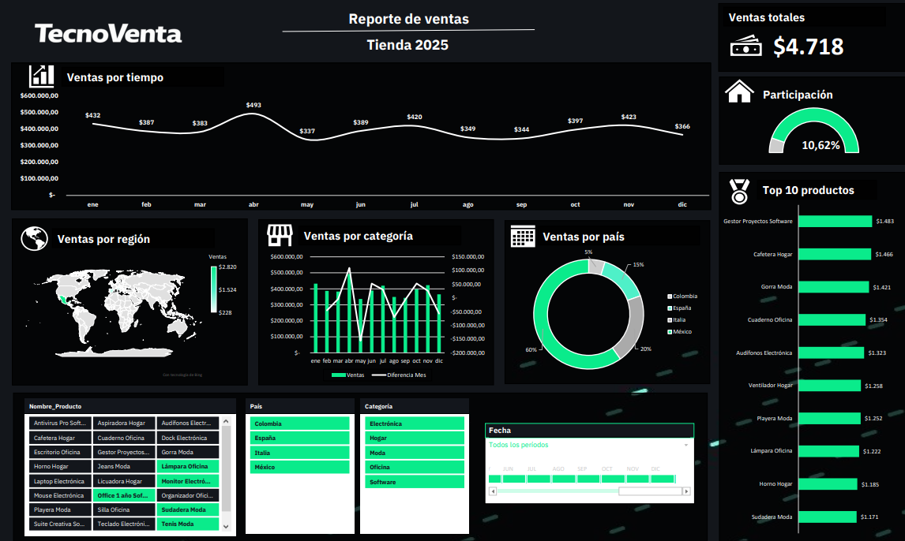

# Sales Analysis Dashboard

This project presents an interactive sales analysis dashboard developed in Microsoft Excel using pivot tables, charts, slicers.

The dashboard provides insights into sales performance, customer behavior, and store metrics through dynamic visualizations.

## Objectives

- Analyze sales performance across different categories
- Visualize key business metrics
- Build an interactive dashboard for data exploration
- Identify trends and patterns in store sales

## Tools and Technologies

- Microsoft Excel
- Pivot Tables
- Pivot Charts
- Data Visualization
- Business Analytics

## Dashboard Preview

## Features

- Interactive filters and slicers
- Dynamic KPIs
- Sales trend analysis
- Regional and category-based insights
- Automated visual reporting
